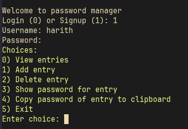
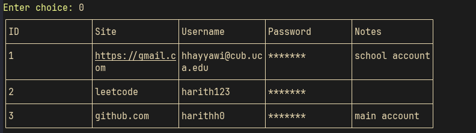
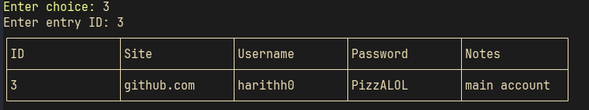
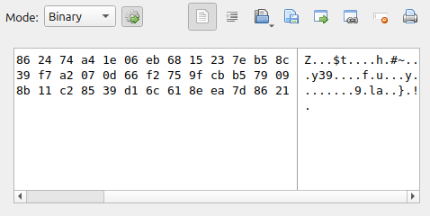
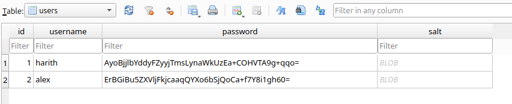

## Secure Password Manager

A simple, command-line password manager written in Java. Stores user passwords securely in a local SQLite database with encryption support. 

## Features

- Add, view, and delete password entries
- Encrypt sensitive information (passwords, notes) per user
- Secure login system with hashed passwords
- Simple CLI interface for quick access
- Local SQLite database storage

## Requirments
- Java 24+ (not tested on other versions)
- Libraries inside `lib/`


## Showcase 

#### CLI




> Adding entry


> Showing entries


> Accessing password for specific entry

#### Database



> Encrypted entries table


> Users table


## Setup

1. Clone repo
2. Run inside root folder:

```shell
javac -cp "..:./libs/*" src/*.java && java -cp "src:libs/*" Main


